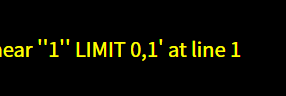
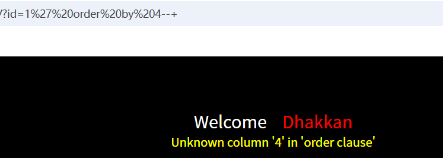
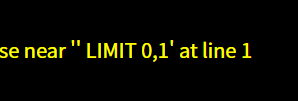
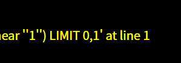
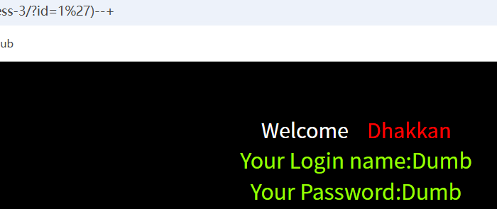
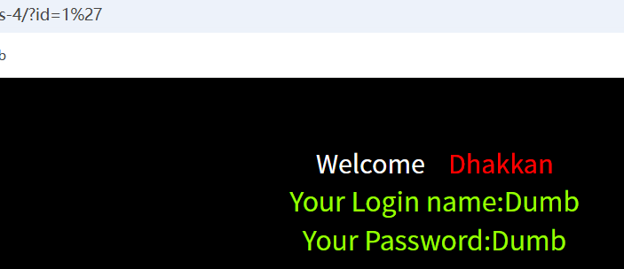
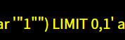

# 本篇文章是关与sal-labs靶场1-4的解题过程。其知识点与sql注入相关。
## 第一关

从题目可以得知本题是关于单引号注入的题目。
故我们可以进行初步尝试通过hackbar在url后面加上?id=1',然后查看页面。可以看出出现报错，这里说一下最前与最后两个引号是提示错误信息的，而我们可以明显看出来错误信息是1后面多了个'

ok,接着爆出它的显位为2与3，注意这里注释应该为--(注意有一个空格)，而url中空格会被编写为+，故我们用--+来注释。
接着我们尝试爆出它有几列，可以看出为3列。

接着继续进行爆出数据库名为security

然后尝试爆出表名?id=-1' union select 1,2,group_concat(table_name)from information_schema.tables where table_schema='security'--+

一般账户和密码都在users表中，所以我们尝试爆出users表的列名。(如果users表中没有的话我们再尝试爆出其他表的列名)
?id=-1' union select 1,2,group_concat(column_name)from information_schema.columns where table_name='users'--+

接下来就是获取账号和密码了，为了方便分清账号和密码中间用id隔开。
?id=-1' union select 1,2,group_concat(username,id,password)from users--+

## 第二关
从题目可与得知本题是整数型的注入，我们也能从报错中得到信息。
跟第一关一样进行尝试?id=1' 然后从报错信息中我们可以看到多出来个单引号，可以说明是整数型得。

接下来得操作就与第一关一样了，不多赘述。
## 第三关
这一关我们不看题目了直接进入进行尝试依旧?id=1' 然后我们去分析报错，去掉首尾两个单引号余下'1''）其中1'是我们输入的值，而mysql中引号与单引号一般都是成对出现的说明后面的'）是用来闭合前面的，故本题我们的闭合方法是?id=1'）--+

接下来的操作就与第一关一样了。
## 第四关
我们还是?id=1' 然后我们发现它不报错了，这里大胆猜测是因为在双引号中单引号是可以存在的

我们尝试?id=1"出现报错，跟第三关的分析差不多我们可以轻易得出闭合为?id=1"）--+

