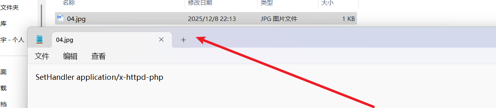

# 本篇文章是关于文件上传漏洞的学习。

- [绕过前端JS检测上传文件](#绕过前端JS检测上传文件)
- [绕过contnet-type检测](#绕过contnet-type检测)
- [黑名单绕过](#黑名单绕过)
- [.htaccess绕过](#htaccess绕过)

## 绕过前端JS检测上传文件
有些网站会通过前端JS对上传的文件进行一个检测，这些数据没有经过目标服务器，是可控的，对于前端JS检测有很多绕过的方法：
1. 禁用浏览器JS功能
2. F12删除对应的规则
3. Burp等工具抓包
一般禁用JS是最简单的做法，只有禁用JS后网页完全不正常了才会考虑其他方法

## 绕过contnet-type检测
有些网站在上传文件时会检测HTTP请求的请求头中的contnet-type，通过用Burp等软件进行抓包并修改请求头中的contnet-type就可以实现文件上传。
去搜索一下关于content-type的定义：  

在HTTP协议消息头中，使用Content-Type来表示媒体类型信息。它被用来告诉服务端如何处理请求的数据，以及告诉客户端（一般是浏览器）如何解析响应的数据，比如显示图片，解析html或仅仅展示一个文本等。

Post请求的内容放置在请求体中，Content-Type定义了请求体的编码格式。数据发送出去后，还需要接收端解析才可以。接收端依靠请求头中的Content-Type字段来获知请求体的编码格式，最后再进行解析。

这里我们以upload-labs靶场的第二关为例：
我们用burpsuite进行抓包，在请求头中找到content-type，修改为image/png，然后重放。

去上传目录中可以看到文件上传成功。

## 黑名单绕过
有些网站在上传文件时会获取文件的后缀名并将其与黑名单进行比对，如果攻击者的文件后缀名在黑名单中则上传文件会被拦截。

对于黑名单我们只需要将文件后缀名改成不在黑名单内的即可（黑盒情况下一个一个试），例如php1、php2、php3、phtml、ashx等等

以uploads-lab靶场第三关为例：
我们上传一个文件发现有个失败提示：
我们用burpsuite进行抓包，把后缀改为php1，然后重放。
在目录中可以看到上传成功。

## .htaccess绕过
使用.htaccess绕过
假如网站的黑名单设置的很全面，将所有可用后缀名（如.phtml）都屏蔽了，我们可以尝试上传.htaccess来实现绕过。

htaccess 文件的作用是可以帮我们实现包括：文件夹密码保护、用户自动重定向、自定 义错误页面、改变你的文件扩展名、封禁特定 IP 地址的用户、只允许特定 IP 地 址的用户、禁止目录列表，以及使用其他文件作为index文件等一些功能。在 htaccess 里写入 SetHandler application/x-httpd-php 则可以将文件重写成php文 件。要htaccess的规则生效则需要在apache开启rewrite重写模块，因为apache是多数都开启这个模块，所以规则一般都生效。

以uploads-lab靶场第四关为例：

创建一个.htaccess文件并在其中写入 SetHandler application/x-httpd-php并上传，该内容的作用是将所有文件都当作php文件来执行，所以我们将php文件的后缀名改为其他任何允许上传的后缀，如png，jpg等就可以实现将其中的内容作为php代码执行。

我们在上传目录中查看上传成功，且查看内容为如图
