# 本篇文章是关于文件上传漏洞的学习。

- [绕过前端JS检测上传文件](#绕过前端JS检测上传文件)
- [绕过contnet-type检测](#绕过contnet-type检测)
- [黑名单绕过](#黑名单绕过)
- [.htaccess绕过](#htaccess绕过)
- [大小写绕过](#大小写绕过)
- [空格绕过](#空格绕过)
- [加点绕过](#加点绕过)
- [NTFS交换数据流绕过](#ntfs交换数据流绕过)
- [. .绕过](#dot-bypass)
- [双写绕过](#双写绕过)
- [目录可控%00截断绕过](#目录可控00截断绕过)
- [POST%00截断绕过](#post00截断绕过)
[🔝 回到顶部](#top)

## 绕过前端JS检测上传文件
有些网站会通过前端JS对上传的文件进行一个检测，这些数据没有经过目标服务器，是可控的，对于前端JS检测有很多绕过的方法：
1. 禁用浏览器JS功能
2. F12删除对应的规则
3. Burp等工具抓包
一般禁用JS是最简单的做法，只有禁用JS后网页完全不正常了才会考虑其他方法

## 绕过contnet-type检测
有些网站在上传文件时会检测HTTP请求的请求头中的contnet-type，通过用Burp等软件进行抓包并修改请求头中的contnet-type就可以实现文件上传。
去搜索一下关于content-type的定义：  

在HTTP协议消息头中，使用Content-Type来表示媒体类型信息。它被用来告诉服务端如何处理请求的数据，以及告诉客户端（一般是浏览器）如何解析响应的数据，比如显示图片，解析html或仅仅展示一个文本等。

Post请求的内容放置在请求体中，Content-Type定义了请求体的编码格式。数据发送出去后，还需要接收端解析才可以。接收端依靠请求头中的Content-Type字段来获知请求体的编码格式，最后再进行解析。

这里我们以upload-labs靶场的第二关为例：
我们用burpsuite进行抓包，在请求头中找到content-type，修改为image/png，然后重放。
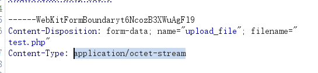
去上传目录中可以看到文件上传成功。
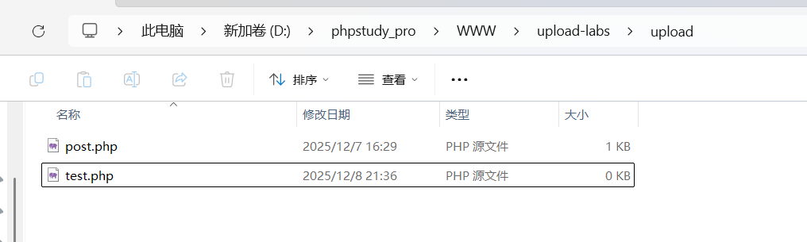   
[🔝 回到顶部](#top)

## 黑名单绕过
有些网站在上传文件时会获取文件的后缀名并将其与黑名单进行比对，如果攻击者的文件后缀名在黑名单中则上传文件会被拦截。

对于黑名单我们只需要将文件后缀名改成不在黑名单内的即可（黑盒情况下一个一个试），例如php1、php2、php3、phtml、ashx等等

以uploads-lab靶场第三关为例：
我们上传一个文件发现有个失败提示：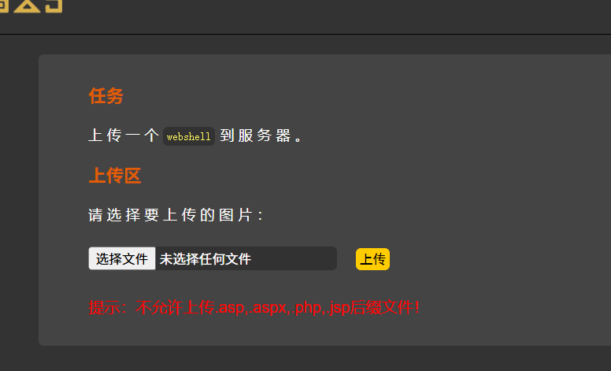
我们用burpsuite进行抓包，把后缀改为php1，然后重放。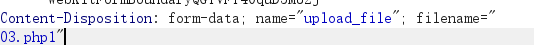
在目录中可以看到上传成功。

## .htaccess绕过
使用.htaccess绕过
假如网站的黑名单设置的很全面，将所有可用后缀名（如.phtml）都屏蔽了，我们可以尝试上传.htaccess来实现绕过。

htaccess 文件的作用是可以帮我们实现包括：文件夹密码保护、用户自动重定向、自定 义错误页面、改变你的文件扩展名、封禁特定 IP 地址的用户、只允许特定 IP 地 址的用户、禁止目录列表，以及使用其他文件作为index文件等一些功能。在 htaccess 里写入 SetHandler application/x-httpd-php 则可以将文件重写成php文 件。要htaccess的规则生效则需要在apache开启rewrite重写模块，因为apache是多数都开启这个模块，所以规则一般都生效。

以uploads-lab靶场第四关为例：

创建一个.htaccess文件并在其中写入 SetHandler application/x-httpd-php并上传，该内容的作用是将所有文件都当作php文件来执行，所以我们将php文件的后缀名改为其他任何允许上传的后缀，如png，jpg等就可以实现将其中的内容作为php代码执行。

我们在上传目录中查看上传成功。  
[🔝 回到顶部](#top)

## 大小写绕过
有的限制条件没有严格过滤大小写，可以通过更改大小写进行上传，如php可以改为PHP、Php、pHp等后缀，即可绕过上传。

以uploads-lab靶场第五关为例：
查看源代码，发现代码逻辑新增把 .htaccess给限制了，但没有限制大小写。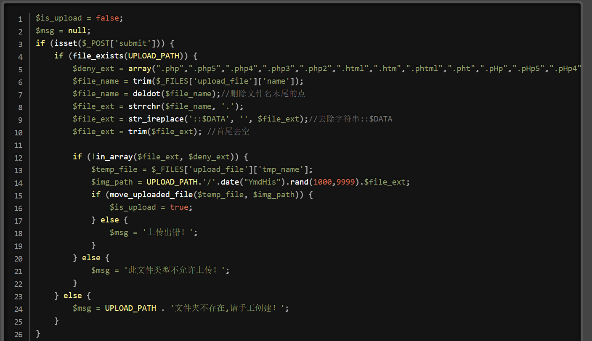
上传文件用bp抓包更改文件后缀大小写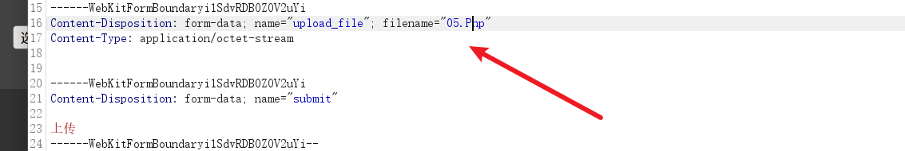
最后从返回结果中可以看到上传成功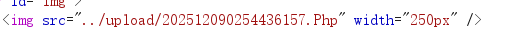

## 空格绕过
如果有的网站没有对上传的文件进行首尾去空处理，那么在传输过程中抓包，将文件名的后面接入一个空格即可实现上传。
第六关源代码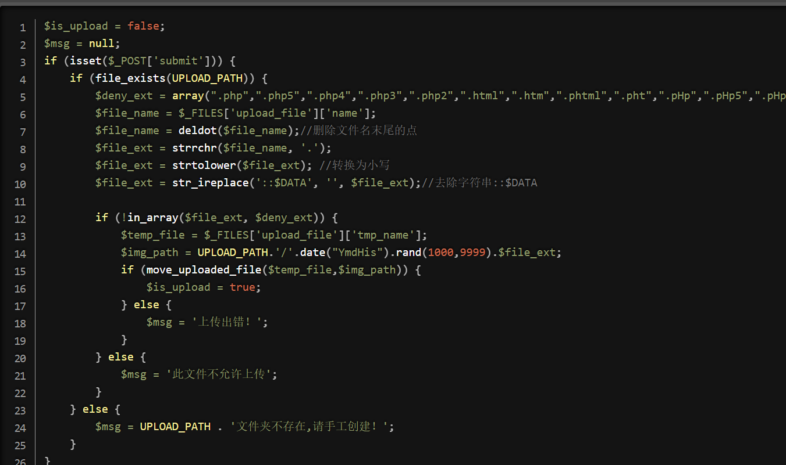
本来想以uploads-lab靶场第六关为例的，但不知道哪里的环境搞错了，按理来说后面加个空格应该是可以的，但这里一直出错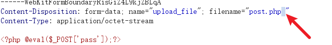，网上找了半天做法跟我是一样的，但我这里还是不行。

## 加点绕过
有的网站没有去掉文件最后的点，我们可以利用Windows特性会自动去掉后缀名中最后的.可在后缀名中加 . 绕过。

在这里第七关出现了跟第六关一样的问题。
[🔝 回到顶部](#top)

## NTFS交换数据流绕过
以uploads-lab靶场第八关为例。
抓包在文件名后面加入::$DATA进行绕过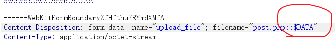
通过结果可以看到上传成功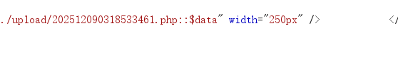

<h2 id="dot-bypass">. .绕过</h2>
有的网站之过滤一次空格和.所以可以用.空格.来绕过。
这里以uploads-lab靶场第九关为例。
依旧抓包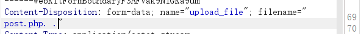
结果如图上传成功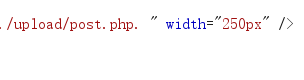

# 双写绕过
有的网站会自动删除后缀中的敏感内容（如a.php会编程a.），这时候可以对文件后缀进行双写，比如.php写成.pphphp这样网页再过滤的时候自动就删除了中间的php，最后得到的是一个.php文件。
这里以uploads-lab靶场第十关为例。
依旧抓包进行修改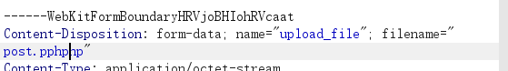
结果如图上传成功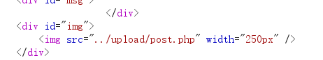   
[🔝 回到顶部](#top)

## 白名单绕过
以上都是一些黑名单被绕过的，与黑名单相对的就是白名单，使用白名单验证会相对比较安全，因 为只允许指定的文件后缀名。但是如果有可控的参数目录，也存在被绕过的风险。

## 目录可控%00截断绕过
上传参数可控时当gpc关闭的情况下，可以用%00对目录或者文件名进行截断。

要求：php版本小于 5.3.4

首先截断攻击，抓包上传将%00自动截断后面内容。

这里以第十一关为例。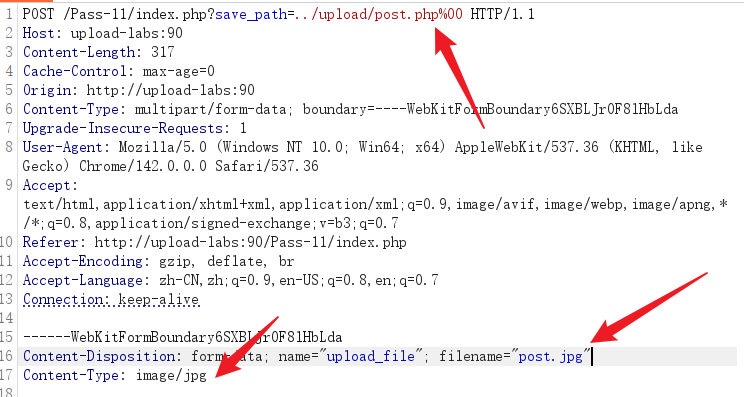

## POST%00截断绕过
有些网站使用POST传参，这样我们直接修改路径是无效的，需要修改路径后使用urldecode（burpsuit右键菜单中自带）转码后再传参方可使用。

[🔝 回到顶部](#top)
