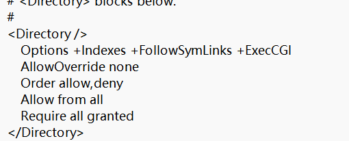

# 服务器配置漏洞学习


# 文件解析漏洞
文件解析漏洞较为官方的说法是指Web容器(Apache、Nginx、llS等)在解析文件时，将非脚本文件解析成脚本文件格式并得以执行而产生的漏洞。黑客可以利用该漏洞实现非法文件的解析。文件解析漏洞主要由于网站管理员操作不当或者Web服务器自身的漏洞，导致一些特殊文件被IIS、apache、nginx或其他Web服务器在某种情况下解释成脚本文件执行。 

Apache HTTPD多后缀解析漏洞:     

Apache HTTPD支持一个文件拥有多个后缀，并为不同的后缀执行不同的指令。Apache默认一个文件可以有多个以点分隔的后缀，当有右边的后缀无法识别（不在mime.types中），则继续往左识别，比如当我们请求文件1.php.jpg,jpg后缀无法识别，发现后缀是php，接下来会将这个文件交给php处理，但jphp不认识jpg这个后缀，无法解析。而运维人员在配置服务器时为了使Apaache服务器能解析php，会自己加一个handler

AddHandler application/x-httpd-php .php 

这样我们可以利用这个特性，造成一个可以绕过上传白名单的解析漏洞。

# 目录遍历漏洞

## Apache目录遍历漏洞

```
Options -Indexes -FollowSymLinks +ExecCGI
-Indexes 禁用目录列表，使得目录无法直接浏览
+Indexes 代表允许列出目录
```
## Nginx目录穿越漏洞
```
location / {
    autoindex on; //允许列出目录
    alias "D:/phphstudy/www/nginx/";
}

```